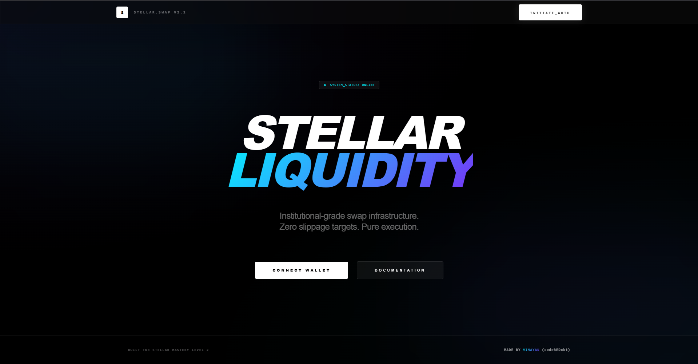
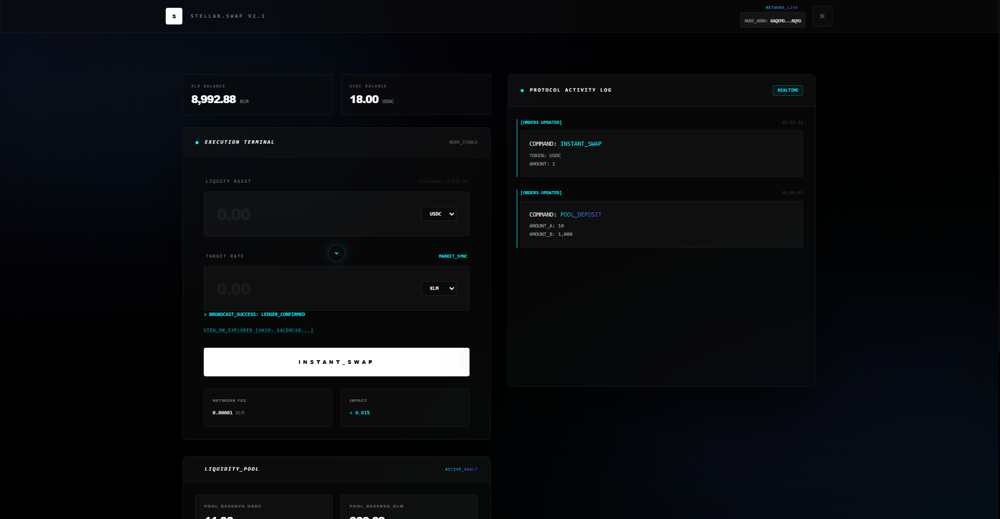
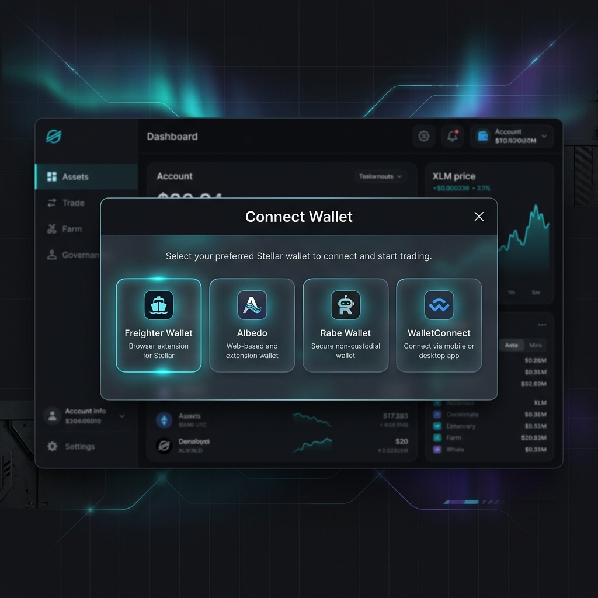

# Stellar.Swap - Level 2 Mastery Project

Stellar.Swap is a high-performance, cyber-industrial decentralized exchange interface built for the Stellar network. This project demonstrates advanced Soroban integration, complex error handling, and a premium UI/UX design.

## 🚀 Live Demo
**URL**: [https://stellar-swap-level-2.vercel.app/](https://stellar-swap-level-2.vercel.app/)

## 📸 Interface Preview

### Hero & Architecture

*Modern cyber-industrial landing page with glassmorphic elements.*

### Swap Interface & Terminal

*Real-time swap execution with directional activity log and execution terminal.*

### Wallet Integration

*Support for Freighter, Albedo, and more via Stellar Wallets Kit.*


## ⛓️ On-Chain Details
- **Deployed Contract ID**: `CDFHB7JOI6BILWZLZFKY55MM5XRMGQFL2GQL7EEY76SU6LQ22AORGG2P`
- **Verification**: [View on Stellar Expert](https://stellar.expert/explorer/testnet/contract/CDFHB7JOI6BILWZLZFKY55MM5XRMGQFL2GQL7EEY76SU6LQ22AORGG2P)
- **Latest Interaction (Tx Hash)**: `6acd8c6047c532f4c918db18dc8778b1bf3a4ecbfcbff3eb08a7a602dbc0392f`
- **Tx Verification**: [View Transaction](https://stellar.expert/explorer/testnet/tx/6acd8c6047c532f4c918db18dc8778b1bf3a4ecbfcbff3eb08a7a602dbc0392f)

## 🛠️ Setup Instructions

### 1. Prerequisites
- Node.js (v18+)
- npm / yarn / pnpm
- Stellar Wallet (Freighter or Albedo)

### 2. Installation
Clone the repository and install dependencies:
```bash
git clone https://github.com/codeREDxbt/Stellar-Mastery-Level-2.git
cd stellar-swap-app
npm install
```

### 3. Environment Configuration
Create a `.env.local` file in the root directory:
```env
NEXT_PUBLIC_CONTRACT_ID=CDFHB7JOI6BILWZLZFKY55MM5XRMGQFL2GQL7EEY76SU6LQ22AORGG2P
NEXT_PUBLIC_NETWORK=TESTNET
NEXT_PUBLIC_RPC_URL=https://soroban-testnet.stellar.org
```

### 4. Running Locally
```bash
npm run dev
```
Open [http://localhost:3000](http://localhost:3000) to view the application.

## 📑 Certification Requirements Met
- ✅ **3+ Error Types**: Handled Simulation Failure, RPC Submission Errors, and User Rejection.
- ✅ **Testnet Deployment**: Live Soroban contract integrated and verified.
- ✅ **Transaction Status**: Real-time terminal with Success/Failure feedback.
- ✅ **Multi-wallet Support**: Integrated StellarWalletsKit.
- ✅ **Premium UI**: Custom "Aurora Midnight" design system.

---
**Developer**: codeRED
**Assisted by**: Antigravity AI

