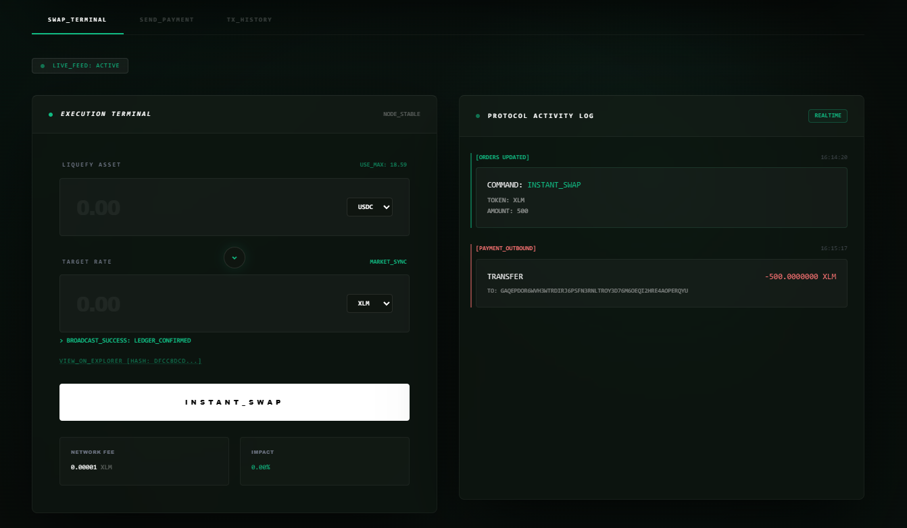
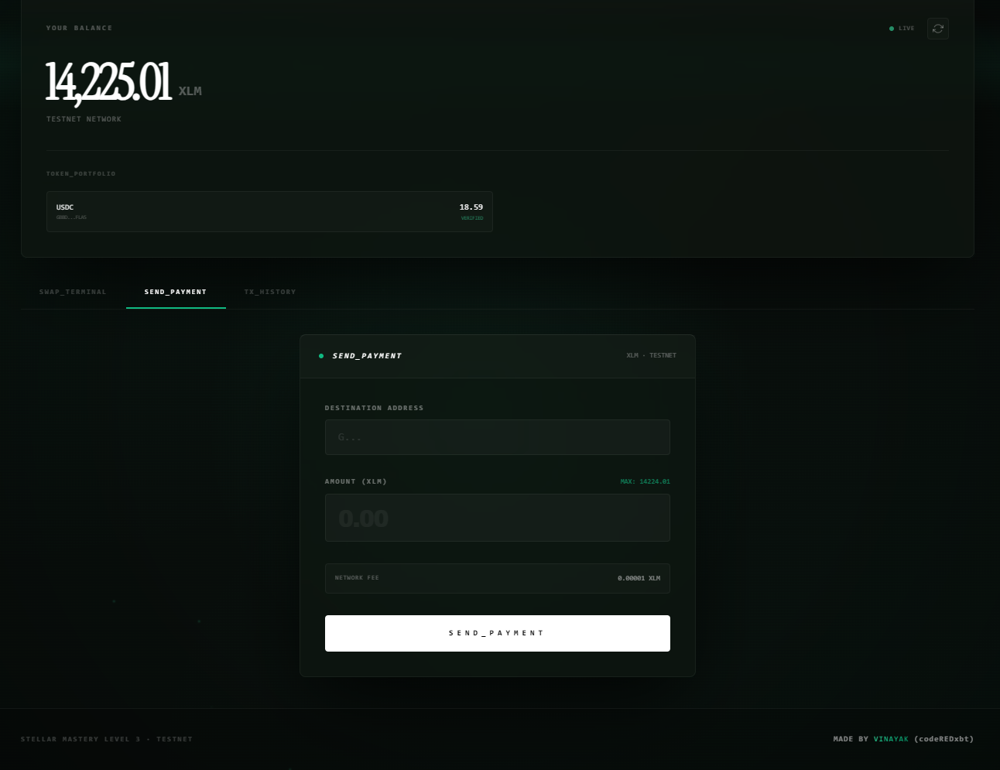
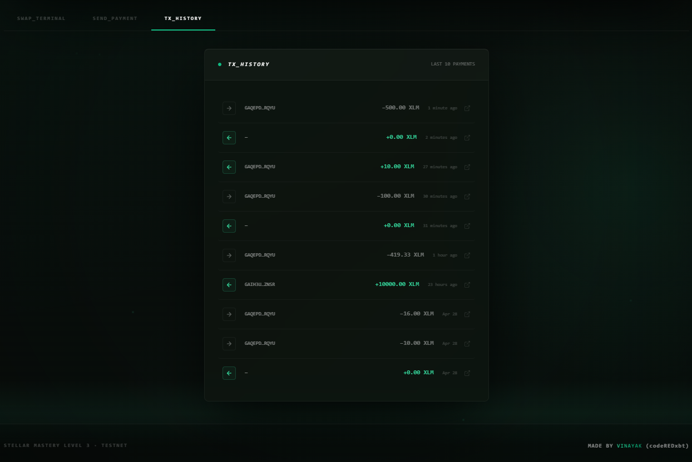
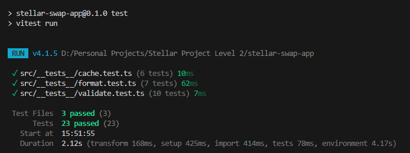

# StellarPulse: Premium Testnet Terminal 🌌

StellarPulse is a production-grade Stellar Testnet payment and swap mini-dApp. It features a high-end **Obsidian + Emerald** aesthetic, optimized for clarity, speed, and precision. Built as part of the Stellar Mastery Level 2 journey.

---

## 🔗 Submission Deliverables

- **Live Demo**: [🚀 View Live App](https://stellarpulse-xi.vercel.app)
- **Demo Video**: [🎬 1-Minute Walkthrough](https://drive.google.com/file/d/1I9TLx6t6Y-EMJUjOH8d1i0h7Dva43YCL/view?usp=sharing)
- **GitHub Repository**: [📂 Source Code](https://github.com/codeREDxbt/Stellar-Mastery-Level-3)

---

## 📸 Visual Walkthrough

### Swap Terminal


### Send Payment


### Transaction History


---

## ✨ Features & Architecture

### 🛡️ StellarCache Engine
Implemented a **Stale-While-Revalidate (SWR)** caching layer. 
- Balances are instantly served from memory.
- Background revalidation ensures data freshness without UI flickering.
- Prevents redundant Horizon API calls and rate-limiting.

### 💎 Obsidian + Emerald Design System
A custom monochrome-tech aesthetic built from the ground up:
- **Dynamic Depth**: Cinematic noise texture and interactive radial mouse-glow.
- **The Pulse**: Flowing emerald borders and animated "ember" particles.
- **Instrument Serif Typography**: Premium editorial-style font for financial balances.

### 🏦 Multi-Asset Portfolio
Unlike basic dApps, StellarPulse tracks your **entire ledger portfolio**:
- Automatic detection of **XLM**, **USDC**, and custom testnet assets.
- Integrated **Swap Terminal** with real-time price impact calculation based on liquidity pool reserves.

### ⚡ Self-Healing Event Stream
Horizon SSE streams are hardened with an **automatic reconnection loop**, ensuring your live payment feed stays "Pulse-active" even after network drops.

---

## 🌐 Network Configuration

StellarPulse is configured for the **Stellar Testnet** out of the box.

- **Horizon URL**: `https://horizon-testnet.stellar.org`
- **Network Passphrase**: `Test SDF Network ; September 2015`
- **Supported Assets**:
  - **Native**: XLM
  - **Verified USDC**: `GBBD47IF...FLA5` (Testnet Issuer)
- **Liquidity Pool**: Constant-product (x*y=k) for the XLM/USDC pair.

---

## 🧪 Quality Assurance

The project is backed by a robust testing suite using **Vitest**, ensuring reliability in formatting, validation, and core logic.

### Test Results (23/23 Passing)


```bash
✓ src/__tests__/cache.test.ts (6 tests)
✓ src/__tests__/format.test.ts (7 tests)
✓ src/__tests__/validate.test.ts (10 tests)

Test Files  3 passed
Tests       23 passed
```

---

## 🛠️ Installation & Setup

1. **Clone & Install**:
   ```bash
   git clone https://github.com/YOUR_USER/stellar-swap-app.git
   cd stellar-swap-app
   npm install
   ```

2. **Environment Variables**:
   Create a `.env.local` file:
   ```env
   NEXT_PUBLIC_HORIZON_URL=https://horizon-testnet.stellar.org
   ```

3. **Run for Production**:
   ```bash
   npm run dev
   ```
   *Note: Requires HTTPS (enabled via `--experimental-https`) for Freighter Wallet compatibility.*

---

## 👨‍💻 Author
**VINAYAK (codeREDxbt)**  
*Stellar Mastery Level 3 · Testnet Expert*
